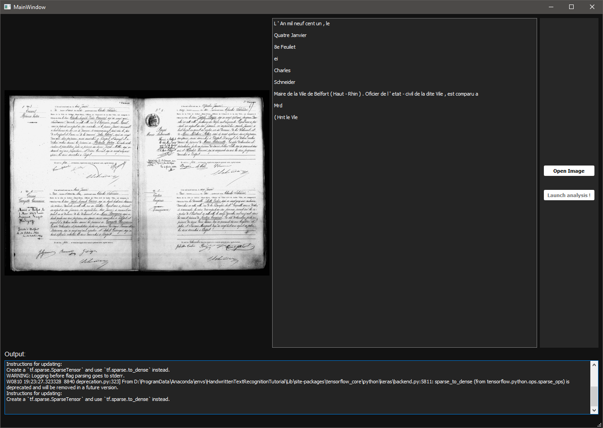

# CivilRegistryAnalyzer

This tools aims to assist the segmentation of civil registry documents with image processing and machine learning
algorithms.

*This project is a proof of concept that should not be used for production purposes as it is, since it can be highly unstable.*

## Features

### DatasetBuilder

- Auto segmentation of a text sample image
- GUI to help and speed up the translation of image text into ascii by the user
  -  Shortcut (Enter to validate translation, Escape to skip the current image)
- Provide JSON file containing translated text and segmented fragment into the selected folder


### CivilRegistryAnalyser

- Auto segmentation of a text sample image
- Text recognition on fragmented images
- Text features extractions with NLP.


   
## Installation

### Dependencies

- OpenCv (Tested with >= 4.0.1)
- Qt (Tested with >= 5.11.2)
- Python 3 

You might also need CUDA if you want to use Tensorflow's GPU version.

In order to use conda environment inside the software you need to provide the following environment variables :

- PYTHONHOME = `<PathToAnacondaInstallation>\Anaconda\envs\<TheEnvironmentYouWantToUse>`
- PYTHONPATH = 
    - `<PathToAnacondaInstallation>\Anaconda\envs\<TheEnvironmentYouWantToUse>\DLLs\`
    - `<PathToAnacondaInstallation>\Anaconda\envs\<TheEnvironmentYouWantToUse>\Lib\`
    - `<PathToAnacondaInstallation>\Anaconda\envs\<TheEnvironmentYouWantToUse>\Lib\site-packages`
- Add the following paths in your PATH :
    - `<PathToAnacondaInstallation>\Anaconda\envs\<TheEnvironmentYouWantToUse>\Library\bin`
    - `<PathToAnacondaInstallation>\Anaconda\envs\<TheEnvironmentYouWantToUse>\Library\Scripts`
    - `<PathToAnacondaInstallation>\Anaconda\envs\<TheEnvironmentYouWantToUse>\Library`

### Clone and  Build

```
git clone --recurse-submodules -j8 https://github.com/PlathC/CivilRegistryAnalyser.git
cd CivilRegistryAnalyser
pip install -r requirements.txt

mkdir build && cd build
cmake ..
cmake --build .
```

## Assets

For any other dataset than the one created using the DatasetBuilder you can follow this [tutorial](https://github.com/arthurflor23/handwritten-text-recognition/blob/master/src/tutorial.ipynb) 

### Dataset transformation

Once the image transcription is finished and that you have enough data create a `raw` folder in the `py` folder and a `civil` folder in the `raw` folder. Once all the folders are 
created, put all the folders created by the DatasetBuilder and the `transcription.json` file in the `civil` folder. Then you can run the `transform.py` that will create the HDF5 file 
that will be read for the training. You will find this file in the `data` folder that has been created.

### Model training

To train the model on the dataset you've just created you just need to run the `training.py` file.

If when training your model on the dataset created thanks to our dataset builder you have an error such as `No valid path found` for the loss calculator, try to go to the definition of the 
function `ctc_batch_cost()` used line 261 in the `ctc_loss_lambda_func()` function in the `src/network/model.py`. Once you're in the function `ctc_batch_cost()` add the parameter `ignore_longer_outputs_than_inputs=True`
to the `ctc.ctc_loss()` function that should be on lines 5763-5764.

### Model testing

Once the training is finished you can run tests to see if the training you have done is efficient. To do so you just need to run the `test.py` file. If you want to replace the
model used in the CivilRegistryAnalyser you need to replace the `checkpoint_weights.hdf5` file in the `py` folder by the one that has been created in `output/civil/flor`. 

## Based on

- [arthurflor23 / handwritten-text-recognition](https://github.com/arthurflor23/handwritten-text-recognition)
- [arthurflor23 / text-segmentation](https://github.com/arthurflor23/text-segmentation)

## Contributors

[Enzo Bonnot](https://github.com/enzo-bonnot)

[Cyprien Plateau--Holleville](https://github.com/PlathC)
